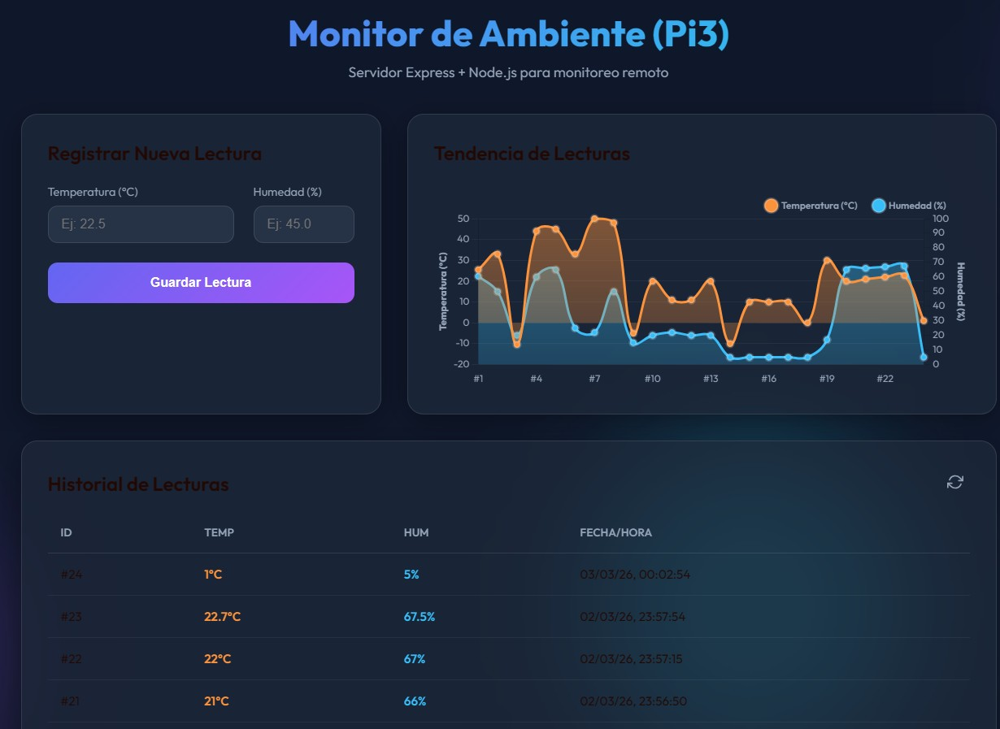

# Guía de Despliegue en Raspberry Pi 3
---
Este proyecto es un servidor de monitoreo ambiental que utiliza **Node.js**, **Express** y **SQLite**. Está diseñado para ser ligero y eficiente, ideal para una Raspberry Pi 3.


## 1. Requisitos Previos en la Raspberry Pi

Asegúrate de tener Node.js instalado. Si no lo tienes, usa estos comandos en la terminal de tu Pi:

```bash
# Actualizar repositorios
sudo apt update

# Instalar Node.js (Versión recomendada para Pi 3)
curl -fsSL https://deb.nodesource.com/setup_18.x | sudo -E bash -
sudo apt-get install -y nodejs
```

## 2. Transferencia de Archivos

Puedes usar `scp` desde tu PC para copiar los archivos a la Pi:

```bash
# Reemplaza 'usuario' e 'ip_de_tu_pi'
scp -r . usuario@ip_de_tu_pi:~/sensor-server
```

O simplemente usa una memoria USB o el gestor de archivos de la Pi.

## 3. Instalación de Dependencias

Una vez dentro de la carpeta del proyecto en la Pi:

```bash
cd ~/sensor-server
npm install
```

## 4. Ejecución Permanente (Recomendado)

Para que el servidor no se detenga si cierras la terminal o si la Pi se reinicia, usa **PM2**:

```bash
# Instalar PM2 globalmente
sudo npm install -g pm2

# Iniciar el servidor
pm2 start server.js --name "sensor-api"

# Configurar para que inicie al arrancar la Pi
pm2 startup
# (Sigue las instrucciones que aparezcan en pantalla, usualmente copiar y pegar un comando)
pm2 save
```

## 5. Acceso al Servidor

Para acceder desde tu PC o celular en la misma red:

1. Busca la IP de tu Pi ejecutando `hostname -I` en la terminal de la Pi.
2. Abre el navegador y escribe: `http://<IP_DE_TU_PI>:3000`

## Estructura de la Base de Datos

La base de datos `sensor_data.db` (SQLite) tiene la siguiente estructura:
- `id`: Entero, Auto-incremental.
- `temperature`: Real (punto flotante).
- `humidity`: Real (punto flotante).
- `timestamp`: Fecha y hora automática.

---
# Test-Raspberry
Ingreso por el usuario, simulando al funcionamiento de un sensor que lee temperatura y humedad
